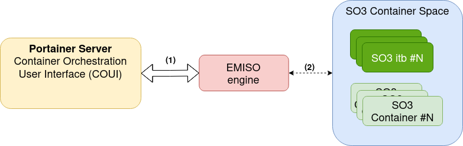
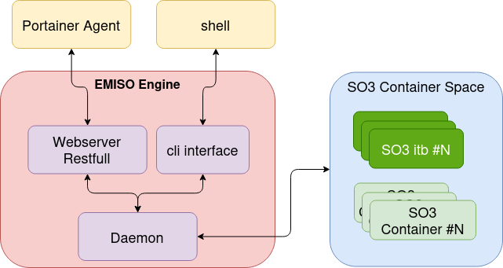

.. _emiso_engine:

############
EMISO Engine
############

.. note::

	Work in progress - the current version only contains basic info.

The EMISO Engine replaces the docker engine in the EMISO environment. It acts as
a gateway between *Portainer* agent and *SO3 containers*. The following picture
presents the communication flow between the *Portainer* Server and *SO3 Containers*.

	Communication flow

**Legends**

	(1) The Portainer Server communicates directly with the EMISO Engine running
	    on the Smart Object. The communication is done via HTTP or HTTPS/TLS using
	    a RESTful API
	(2) EMISO Engine provides an interface to control the SO3 containers.

The application can be called as following:

.. code-block:: shell

	$ emiso_engine [-s] [-i]

Where

* (optional) ``-s``: Start the webserver in secure mode (HTTPS/TLS)
* (optional) ``-i``: Interactive mode - start the cli interface instead of the
  webserver.

************
Architecture
************

The following picture shows the architecture of the EMISO engine. It is constituted
by:

* A Web Server which receives requests from the Docker API. It is a Restful HTTP
  server.
* EMISO Daemon - it handles the interaction with the SO3 Containers
* Cli interface. It offers an entry point to interact with the EMISO Daemon. It is
  used to interact with the SO3 Containers from the user-space mainly for debug
  purposes.

	Engine Architecture

*************
cli interface
*************

The cli interface supports the following commands:

	=====================  ==========================================
	Cmd Name               Description
	=====================  ==========================================
	image info             Return information on the available images
	image rm <IMAGE NAME>  Remove <IMAGE NAME>
	=====================  ==========================================

