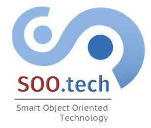

.. doc Documentation master file.

.. toctree::
   :maxdepth: 4
   :numbered:
   :hidden:
  
   introduction
   architecture
   user_guide
   logging
   aarch64
   virt_interfaces/vuihandler
   
======================================
Smart Object Oriented (SOO) Technology
======================================

For any information and discussions related to the SOO framework, please
visit our main discussion forum at https://discourse.heig-vd.ch/c/soo

SOO Concepts and Architecture
=============================

- :ref:`Introduction to SOO <introduction>`
- :ref:`Architecture <architecture>`

Setup and Envronment
====================

-  :ref:`User Guide <user_guide>`
-  `Logging system <logging>`__

SOO Subsystems and functional blocks
====================================

Agency
------

-  `Core subsystem <agency_core>`
-  `DCM (Dedicated Communication Module) subsystem <agency_dcm>`
-  `SOOlink subsystem`

Mobile Entity (ME)
------------------

-  SO3 Enhanced Interactions <ME_so3>
-  Behavioural Patterns <ME_behaviour>

Development flow
================

The master contains the last released version of the SOO framework.

.. important::

   It is not allowed to push directly to the master. Please do a merge
   request as soon as your development is stable.
   
If you want to contribute, please first contact `the maintainer <SOO_mail_>`__ and explain your motivation so that
you can be granted as developer. 
Each development leads to a new issue with its related branch. You can develop freely, add comments along the issue
and perform a merge request as soon as your development gets stable enough. A review will be done and your contributions
will be merged in the master branch. 

Discussion forum
================

A `dedicated discussion forum <https://discourse.heig-vd.ch/c/soo>`__
is available for all questions/remarks/suggestions related to the SOO
framework. Do not hesitate to create topics and to contribute.
     

.. _SOO_mail: info@soo.tech

